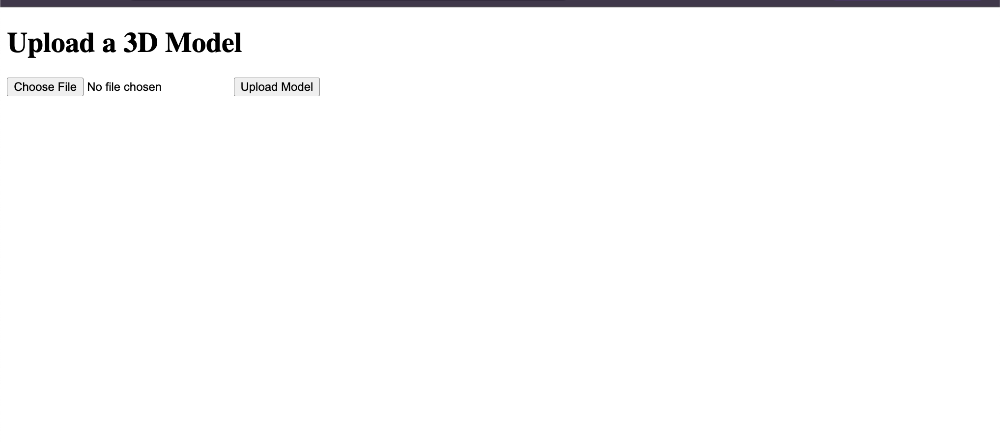
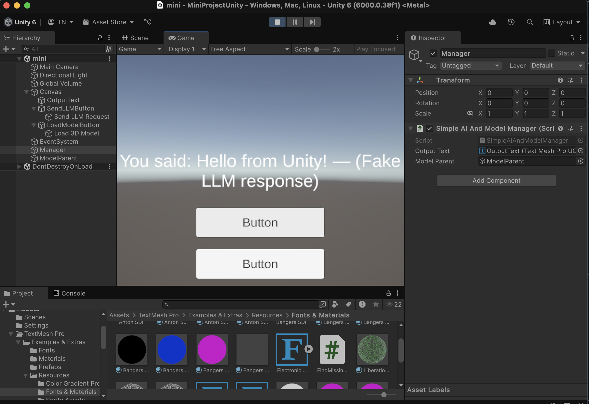
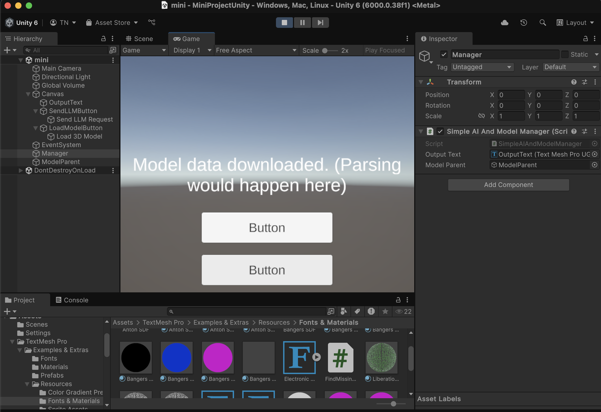

# AICore + ViewPort Mini-Project

A proof-of-concept for integrating a fake AI service (local LLM simulation) and a 3D model upload/view pipeline with Unity as the front-end client. Inspired by real-world projects like AICore (local Large Language Model integration in Unity) and ViewPort (3D model upload & visualization system).

## Table of Contents
1. [Overview](#overview)
2. [Features](#features)
3. [Tech Stack](#tech-stack)
4. [Project Structure](#project-structure)
5. [Prerequisites](#prerequisites)
6. [Setup & Installation](#setup--installation)
7. [Usage](#usage)
8. [Future Improvements](#future-improvements)
9. [License](#license)

## Overview


 - 

 - 

  - 


- **Local "AI" Integration**: Simulates an LLM endpoint (a simple "echo" server) to show how Unity can send/receive data using HTTP.
- **3D Model Upload & Download**: Allows users to upload `.obj` models via a web interface (Node.js + HTML) and download them at runtime in Unity.
- **Basic Full-Stack Workflow**: Showcases Node.js handling both text-based AI routes and file uploads, while Unity calls these endpoints and updates the UI.


## Features
1. **Fake LLM Endpoint**
   - `/api/fake-llm` returns a simple message based on user input (simulate local AI inference).
2. **3D Model Upload**
   - A small web page (`index.html`) lets users upload `.obj/.fbx` files to the server.
   - Server stores files in the `uploads` folder and returns an accessible URL.
3. **Unity Integration**
   - A **Unity C# script** sends POST/GET requests:
     - **Sends** text to the fake LLM route,
     - **Downloads** a `.obj` file from the returned URL.
   - UI updated with status messages (using **TextMeshPro**).
4. **Cross-Platform**
   - Node.js server can run on Windows/Mac/Linux.
   - Unity client can be built for desktop, mobile, or VR.

## Tech Stack
- **Node.js & Express**: REST API, file uploads via `multer`
- **HTML/JS**: Simple front-end page for uploading models
- **Unity**: 3D real-time engine, **C#** scripting, **UnityWebRequest** for HTTP
- **TextMeshPro**: For rendering UI text in Unity
- **Multer**: Handles file storage (uploads) in Node.js
- **Postman / cURL** (optional): Testing endpoints

## Project Structure
```
├─ server.js            # Main Node.js server
├─ package.json         # Node dependencies + scripts
├─ public/              # Static folder served by Node
│   └─ index.html       # Webpage for 3D model uploads
├─ uploads/             # Models saved here by multer
├─ UnityProject/        # Sample Unity 3D project folder
│   ├─ Assets/
│   │   ├─ Scripts/
│   │   │   └─ SimpleAIAndModelManager.cs
│   │   └─ ...
│   └─ ProjectSettings/
│       └─ ...
└─ README.md
```

**Note**: Your exact folder structure may vary. The key elements are:
- **Node.js root** with `server.js`, `package.json`, `public/`, `uploads/`
- **Unity project** in a separate folder (e.g., `UnityProject/`).

## Prerequisites
1. **Node.js** (version 14+ recommended)
2. **Unity** (2021 LTS or newer preferred)
3. **Git** (optional but recommended)
4. **Basic knowledge** of HTTP, REST, and Unity scripting

## Setup & Installation

1. **Clone or Download** this repository:
   ```bash
   git clone https://github.com/YourUsername/AICore-ViewPort-Mini.git
   cd AICore-ViewPort-Mini
   ```

2. **Install Node.js Dependencies**:
   ```bash
   npm install
   ```
   or 
   ```bash
   yarn install
   ```

3. **Create necessary folders**:
   - Make sure you have an **`uploads`** folder at the root (same level as `server.js`).
   - Make sure you have a **`public`** folder containing `index.html`.

4. **Run the Node.js Server**:
   ```bash
   node server.js
   ```
   By default, it listens on `http://localhost:3001`.

5. **Open the Unity Project**:
   - Launch **Unity Hub**,
   - Click **“Add”** and select the **`UnityProject/`** folder,
   - Open the project. 
   - In **Assets** → **Scripts**, check **`SimpleAIAndModelManager.cs`** for hardcoded URLs (pointing to `http://localhost:3001`).

## Usage

### A. Fake LLM Test
1. **Press Play** in Unity.
2. Click the **"Send LLM Request"** button in the Game view UI.
3. **Observe** the `OutputText` in Unity: it should display something like  
   ```
   You said: Hello from Unity! — (Fake LLM response)
   ```

### B. 3D Model Upload & Download
1. **In your browser**, go to:
   ```
   http://localhost:3001/index.html
   ```
2. **Upload** a `.obj` or `.fbx` model file (using the “Upload Model” button).
3. **Copy** the `filePath` from the JSON response (e.g., `http://localhost:3001/uploads/1679001234567.obj`).
4. **Open `SimpleAIAndModelManager.cs`**:
   ```csharp
   string modelUrl = "http://localhost:3001/uploads/YOUR_FILE_NAME.obj";
   ```
   Replace the path with the **response** from step 3.
5. **Play** the Unity scene and click **"Load 3D Model"**:
   - The Unity console or UI text will confirm  
     ```
     Model data downloaded. (Parsing would happen here)
     ```
   - (No actual 3D rendering occurs unless you add a runtime importer.)

## Future Improvements
- **Actual `.obj` Parsing**
  - Add a **runtime OBJ importer** to spawn the 3D model in the scene.
- **Local LLM Integration**
  - Instead of a dummy echo route, integrate a **real** local AI library.
- **Authentication & Security**
  - Add token-based security for uploading sensitive 3D assets.
- **AssetBundle or Addressables**
  - Convert models into Unity AssetBundles for better performance.
- **Performance Monitoring**
  - Log request times, handle concurrent file uploads, optimize streaming.

## License
This project is provided **as-is**, primarily for learning and demonstration. If you plan to use it in production, ensure you follow best practices for **security**, **performance**, and **scalability**.
